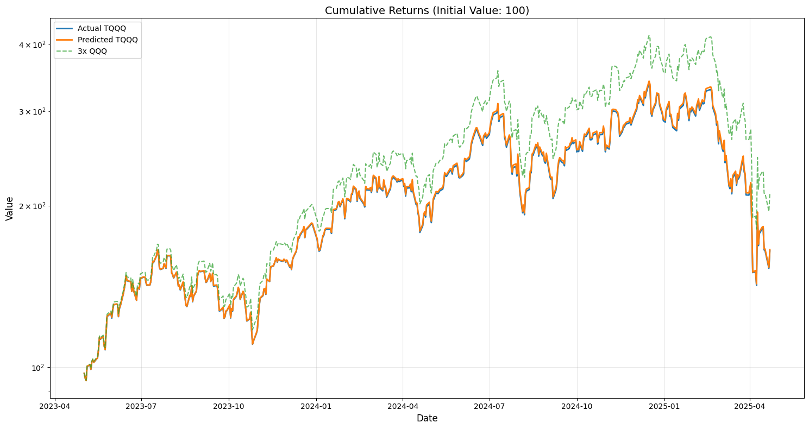

# LeverageGenerator

A deep learning project that predicts the **real leverage ratio** of the leveraged ETF **TQQQ** using market volatility signals and macroeconomic indicators.

## Overview

This project builds a deep learning model to estimate the real-world leverage ratio of TQQQ using features derived from QQQ, VIX, interest rates, and various macroeconomic indicators. The predicted leverage is then used to simulate TQQQ returns and evaluate the accuracy of the model's performance.

## Prerequisites

- Python 3.8+
- 8GB+ RAM recommended
- CUDA 11.0+ (optional, for GPU acceleration)

## Installation

1. Clone the repository:
```bash
git clone https://github.com/Lacri1/LeverageGenerator.git
cd LeverageGenerator
```

2. Create and activate a virtual environment:
```bash
python -m venv .venv
source .venv/bin/activate  # For Linux/macOS
.venv\Scripts\activate     # For Windows
```


## Example Notebook
See `TQQQ_Leverage_Modeling.ipynb` for detailed usage examples.

## Model Description

### Architecture

- **Input shape**: (batch_size, 10, 60+)
- ***Features**: Over 60 indicators including TQQQ price/volatility, VIX signals, interest rates, and macroeconomic metrics (e.g., VIX term structure, yield curve slope, market stress indices)
  
### Network Structure

- **Initial feature processing**: Dense(384) → LayerNormalization

- **Attention Block 1**: MultiHeadAttention (16 heads, key_dim=64) + normalization + dropout

- **BiLSTM Block 1**: Bidirectional LSTM(384, return_sequences=True)

- **Attention Block 2**: MultiHeadAttention(12 heads, key_dim=48)

- **LSTM Blocks 2–3**: BiLSTM(256) → LSTM(192)

- **Dense Layers**:
  - Dense(256, activation=swish) → BatchNorm + Dropout
  - Dense(128, activation=swish) → BatchNorm
  - Dense(1, activation=sigmoid) → OutputScaling([2.990, 3.010])

### Training Parameters

- **Batch size**: 20
- **Epochs**: 200 (10 warmup + 190 main)
- **Optimizer**: Adam(β₁=0.91, β₂=0.9995, ε=1e-8)
- **Learning rate**: 0.00008 with LR scheduler
- **Gradient clipping**: 1.0
- **Validation split**: 12%

### Custom Loss Function: tqqq_focused_loss

Combines multiple penalties:
- Leverage range penalty (100.0)
- Return tracking penalty (60.0)
- Volatility penalty (40.0)
- Correlation penalty (50.0)
- Directional accuracy penalty (30.0)

### Callbacks

- **EarlyStopping**: patience=50, min_delta=1e-6, restore_best_weights=True
- **ReduceLROnPlateau**: patience=25, factor=0.5, min_lr=1e-5

### Performance Evaluation

The following results show how well the model predicts the actual leverage of TQQQ and simulates TQQQ returns based on that prediction.


*Cumulative Returns Comparison (Initial Value: 100)*
- Blue: Actual TQQQ
- Orange: Predicted TQQQ
- Green (dashed): 3x QQQ

**Return Tracking**:
  - Correlation with actual TQQQ: 0.9997
  - Annualized tracking error: 1.62%
    
  **Leverage Accuracy**:
  - Average actual leverage: 2.9986
  - Average predicted leverage: 3.0027
  - Correlation with actual: -0.0388   

  **Risk Metrics**:
  - Daily volatility (actual / predicted): 62.78% / 63.52%
  - Maximum drawdown (actual / predicted): 58.04% / 58.10%

- **Market regime signals**:
  - Stress indices, trend strength, macro regimes

### Improving Backtesting Accuracy

1. **Incorporate Market Regimes**:
- Account for volatility cycles and interest rate environments
- Reflect macroeconomic conditions

2. Model Enhancements
- Use longer time series data
- Integrate additional market indicators
- Improve volatility forecasting

3. Validation Strategies
- Test performance across different market conditions
- Use rolling-window backtesting
- Run stress-test scenarios

## Model Files
- **Trained model**: `leverage_model.keras`
- **Scaler**: `leverage_scaler.pkl`
- **Feature names**: `feature_names.json`

## License

This project is licensed under the MIT License.


